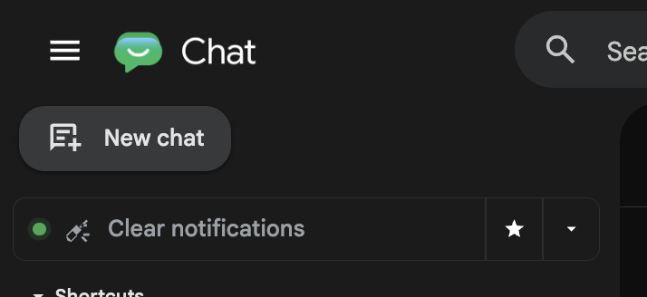
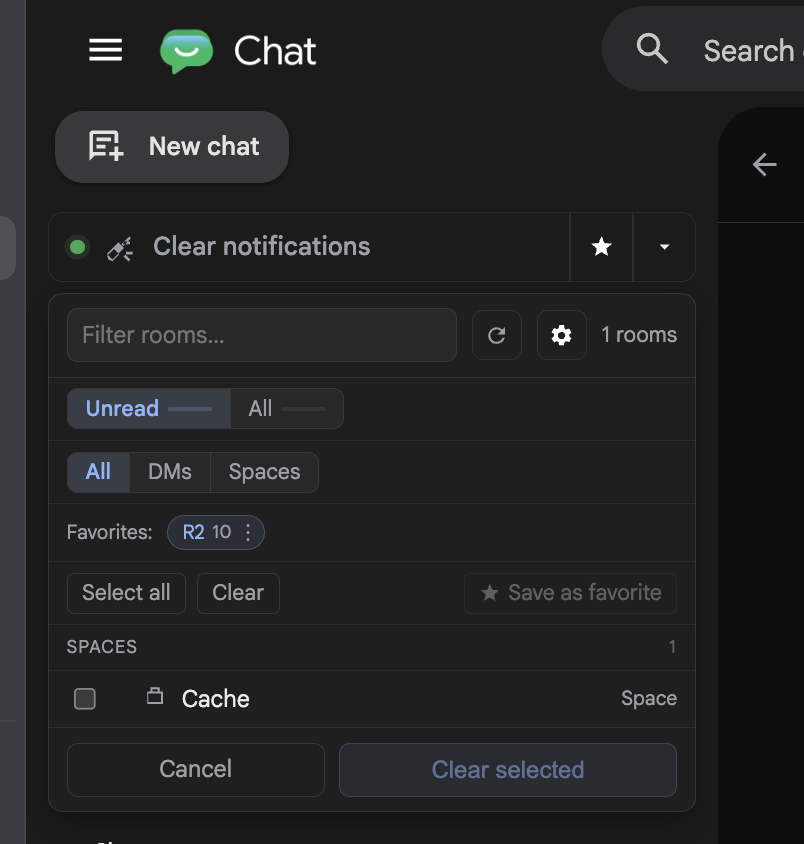
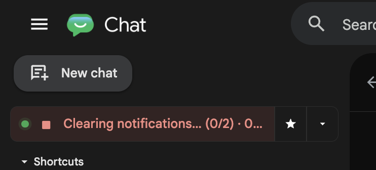

# Google Chat Clear Notifications 

Bulk-clear Google Chat unread notifications from the sidebar. Chrome extension + local Node server.

> **Unofficial.** Uses Google Chat's private web API. Not affiliated with Google. Use at your own risk.

## Screenshots

<table>
  <tr>
    <td width="33%"></td>
    <td width="33%"></td>
    <td width="33%"></td>
  </tr>
</table>

## Install

```bash
git clone https://github.com/Schachte/google-chat-clear-notifications.git
cd google-chat-clear-notifications
./install.sh
```

Then load `extension/` as unpacked in `chrome://extensions` (Developer mode → Load unpacked).

Open [chat.google.com](https://chat.google.com) and click the button below "New chat".

## Features

- One-click clear-all
- Room picker with filters (Unread / All, DMs / Spaces, hide-read)
- Save favorite room sets, re-clear with one click
- Edit / rename / delete favorites in place
- Runs in background (survives terminal close) or foreground

## Requirements

Node ≥ 18, git, Chrome (or Chromium).

## Troubleshooting

Hover the status dot to see the ports in use. If it's red, click **Edit ports** in the error panel.

See [full docs](./docs.md) for details, environment variables, and uninstall.

## Credits

Built on [Schachte/google-chat-api](https://github.com/Schachte/google-chat-api).

## License

[MIT](./LICENSE)
